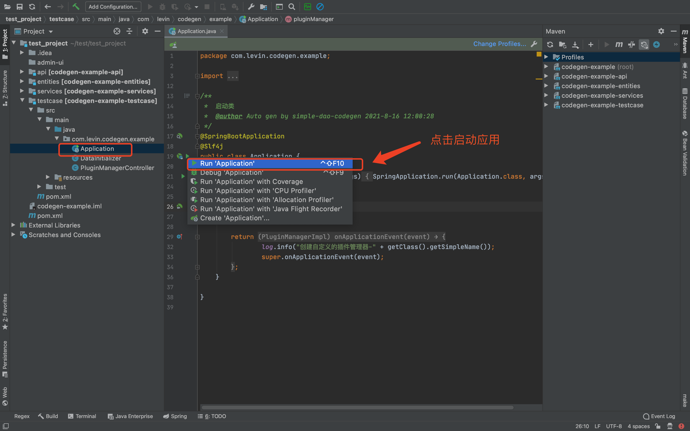

### 简介 
   
   SimpleDao是一个使用注解生成SQL语句和参数的组件，通过在DTO对象中加入自定义注解自动生成查询语句。

   在项目中应用本组件能大量减少语句的编写和SQL参数的处理。组件支持Where子句、标量统计函数和Group By子句、Having子句、Order By子句、Select子句、Update Set子句、子查询、逻辑删除，安全模式等。
 
   目前组件基于JPA/Hibernate，如果非JPA环境，可以使用  genFinalStatement()、 genFinalParamList() 方法以来获取SQL语句和参数。
    
### 1 使用预览

   JPA实体类定义
   
      @Entity(name = "test_entity")
      @Data
      @Accessors(chain = true)
      @FieldNameConstants 
      public class TestEntity{
      
         @Id
         @GeneratedValue
         private Long id;
         
         @Column(nullable = false)
         String name;
         
         @Column(nullable = false)
         String state;
         
         ... 
             
      }
   
#### 1.1 简单查询

           // 查询对象
           @Data
           //声明查询的目标表，和查询结果的对象类型
           @TargetOption(entityClass = TestEntity.class, resultClass = QueryDto.Info.class)
           public class QueryDto {
           
             //针对字段默认为  @Select 注解
             @Select
             @Data
             public static class Info{  
                Long id; 
                String name; 
             } 
             
             //等于注解
             @Eq
             String status;
             
           }
           
           //服务类
           public class TestEntityService{
           
               //注入通用Dao
               @Autowired
               SimpleDao dao;
               
               //查询指定状态的记录，返回QueryDto.Info的结果集
               List<QueryDto.Info> findByStatus(String status){
                  
                   //下面的将生成SQL： select id , name from test_entity where status = ?
                   
                   return dao.findByQueryObj(new QueryDto().setStatus(status));
                   
               }
            
           }

#### 1.2 统计查询

   根据查询对象生成查询语句和参数。
   
   1）定义查询对象
  
       /**
        * 数据传输对象(兼查询对象，通过注解产生SQL语句)
        */
      @Data
      @TargetOption(entityClass = TestEntity.class, resultClass = TestEntityStatDto.class)
      public class TestEntityStatDto {
             
          @Min
          Long minScore; //当minScore字段名在实体对象中不存在时，会尝试自动去除注解的名字 minScore -> score
          
          @Max
          Long maxScore;
      
          @Avg
          Long avgScore;
      
          @Count
          Long countScore;
      
          @GroupBy
          @NotIn
          String[] state = {"A", "B", "C"}; 
      
          @Contains
          String name = "test"; 
      }
   
   2） 查询结果集 
        
         @Autowired
         SimpleDao dao;
         
         //查询并返回结果
 
         List<TestEntityStatDto> result =  dao.findByQueryObj(new TestEntityStatDto());   
 

   生成并执行以下查询语句
   
            Select 
            Min( score ) , 
            Max( score ) , 
            Avg( score ) , 
            Count( 1 ) , 
            state  
            From com.levin.commons.dao.domain.support.TestEntity     
            Where 
            state NOT IN (  ?1 , ?2 , ?3  ) 
            AND name LIKE '%' ||  ?4  || '%'  
            Group By  state
        
 
### 2 快速上手

#### 2.1 一键代码生成

  如果文档中的图片不能显示，请访问 [https://gitee.com/Levin-Li/simple-dao](https://gitee.com/Levin-Li/simple-dao) 查看。
   
##### 2.1.1 创建示例项目
   
   建立一个空Maven项目，把 pom.xml 文件替换成以下内容
   
       <?xml version="1.0" encoding="UTF-8"?>
       <project xmlns="http://maven.apache.org/POM/4.0.0"
                xmlns:xsi="http://www.w3.org/2001/XMLSchema-instance"
                xsi:schemaLocation="http://maven.apache.org/POM/4.0.0 http://maven.apache.org/xsd/maven-4.0.0.xsd">
        
       <modelVersion>4.0.0</modelVersion>
     
       <groupId>com.codegen.example</groupId>
       <artifactId>codegen-example</artifactId>
       <version>1.0.0-SNAPSHOT</version>
   
       <packaging>pom</packaging>
     
    <properties>

        <levin.simple-dao.groupId>com.github.Levin-Li.simple-dao</levin.simple-dao.groupId>
        <levin.simple-dao.version>2.2.27-SNAPSHOT</levin.simple-dao.version> 
        <levin.service-support.groupId>com.github.Levin-Li</levin.service-support.groupId>
        <levin.service-support.version>1.1.21-SNAPSHOT</levin.service-support.version>

    </properties>
  
    <repositories> 
        <repository>
            <id>jitpack.io</id>
            <url>https://jitpack.io</url>
        </repository> 
    </repositories>

    <pluginRepositories>
        <pluginRepository>
            <!--  插件库 -->
            <id>jitpack.io</id>
            <url>https://jitpack.io</url>
        </pluginRepository>
    </pluginRepositories>

    <build>
        <plugins>

            <plugin>
                <groupId>${levin.simple-dao.groupId}</groupId>
                <artifactId>simple-dao-codegen</artifactId>
                <version>${levin.simple-dao.version}</version>

                <dependencies>
                    <dependency>
                        <groupId>${levin.service-support.groupId}</groupId>
                        <artifactId>service-support</artifactId>
                        <version>${levin.service-support.version}</version>
                    </dependency>
                </dependencies>
            </plugin>
 
        </plugins>
    </build>
    
    </project>

##### 2.1.2 生成项目模板和示例文件

   在 IDEA 的 Maven 操作面板上双击插件的 gen-project-template 生成模板文件。
   
   
   
   插件将会生成一个示例模块，生成成功后，请刷新项目。
   
     
##### 2.1.3 编译实体模块

   在生成好的实体模块上编译项目。
    
   

##### 2.1.4 生成代码(在实体模块上双击执行插件!)

   在编译成功后的实体模块上，双击插件的 gen-code 开始生成代码。(注意是在实体模块上双击执行插件!)
   
       
    
   代码生成插件会生成服务类，控制器类，spring boot 自动配置文件，测试用例，插件类等，后续加入会生成 vue和 react 的页面代码。
         
##### 2.1.5 启动testcase程序和查看运行结果
   
   在Maven操作面板上刷新项目，然后启动项目。
    
        
           
   项目启动成功，点击控制台的链接查看运行结果。    
   
       
   
   So Easy!  
        

#### 3 用户手册
     
   其它请查看 [用户手册](./manual.md) 
   

#### 4 鼓励一下
     
   支付宝 微信   
   
       
      

#### 5 联系作者

 邮箱：99668980@qq.com   
 