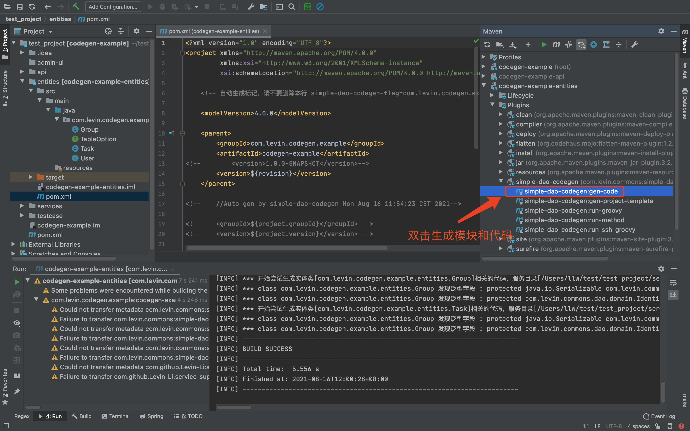

### 简介 
   
   SimpleDao是一个使用注解生成SQL语句和参数的Dao组件，通过在DTO对象中加入自定义注解自动生成查询语句。

   在项目中应用本组件能大量减少SQL语句的编写和参数的处理。组件支持Where子句、标量统计函数和Group By子句、Having子句、Order By子句、Select子句、Update Set子句、子查询、逻辑删除，安全模式等。
 
   目前组件基于JPA/Hibernate，如果非JPA环境，可以使用  genFinalStatement()、 genFinalParamList() 方法以来获取SQL语句和参数。
   
   说重点，组件的Maven插件可以双击生成代码哦。

   组件逻辑架构如下图：   
   
      
   
    
### 1 使用预览

   实体类
   
      //1、学生表
      @Entity(name = "student")
      @Data
      @Accessors(chain = true)
      @FieldNameConstants 
      public class Student{
     
         @Id
         @GeneratedValue
         private Long id;
         
         //学生姓名 
         String name;  
         ...  
      }
      
       //2、考试成绩表
       @Entity(name = "exam_log")
       @Data
       @Accessors(chain = true)
       @FieldNameConstants 
       public class ExamLog{
      
          @Id
          @GeneratedValue
          private Long id;
          
          //学生ID 
          Long studentId;
          
          //学科
          String subject;
          
          //成绩分数
          Integer score;
 
          ... 
             
       }     
      
   需求：
   
   查询并统计出语数英三科考试中总分超过260分，学科平均分高于80分，学生姓名中包含特定字符的学生姓名、总分、平均分。
 
   解决方案：
   
   1）定义查询对象（表连接）
  
   数据传输对象(兼查询对象，通过注解产生SQL语句)
    
      @Data
      @TargetOption(
      
      entityClass =ExamLog.class ,  /* 目标类 */ 
      
      alias = E_ExamLog.ALIAS, // 主表别名
      
      resultClass = ExamStatDto.class,  /* 结果类 */
      
      //表连接
      joinOptions = {
            @JoinOption(entityClass = Student.class, alias = E_Student.ALIAS, joinTargetColumn = E_ExamLog.studentId )  //连接的表
            //可以再连接表2 
         } 
      )
      public class ExamStatDto {
      
          @Sum(having=Op.Gt)
          Long sumScore = 260L;      
              
          @Avg(having=Op.Gt)
          Long avgScore = 80L; //当avgScore字段名在实体对象中不存在时，会尝试自动去除注解的名字 avgScore -> score

          @In
          String[] subject = {"语文", "数学", "英语"};  
        
          @Contains(domain = E_Student.ALIAS) // 过滤出学生名字中包含'李'字
          @GroupBy(domain = E_Student.ALIAS)  // 按名字分组
          String name = "李"; 
          
      }
      
       以上Dto等效的SQL语句如下：
       
          Select 
            s.name ,  Avg(e.score) ,  Sum(e.score) 
          From exam_log e Left Join student s on  s.id = e.studentId
          Where 
            e.subject IN ("语文", "数学", "英语")  AND s.name LIKE '%李%'  
          Group By s.name
          Having Avg(e.score) > 80 and Sum(e.score) > 260
   
   2） 服务层
       
        @Service
        public class ExamStatService {
        
         @Autowired
         SimpleDao dao; //通用 Dao
         
         public List<ExamStatDto> stat(ExamStatDto statDto){
           //一行代码，就一行！！！
           //查询结果自动绑定到 ExamStatDto对象。
           return dao.findByQueryObj(statDto);
         }
         
       }
         
   3）控制器 
     
     @RestController
     public class ExamStatController{
     
        @Autowired
        ExamStatService examStatService;
        
        @GetMapping("/exam_stat")
        public ApiResp<ExamStatDto> stat(ExamStatDto statDto){
            return ApiResp.ok(examStatService.stat(statDto));
        }
        
     }
     
   大功告成，用 postman 测试以一下。这个是组件的多表统计应用，组件还支复杂逻辑嵌套，子查询对象嵌套，逻辑删除等。  
        
 
### 2 快速上手

#### 2.1 一键代码生成

  如果文档中的图片不能显示，请访问 [https://gitee.com/Levin-Li/simple-dao](https://gitee.com/Levin-Li/simple-dao) 查看。
   
##### 2.1.1 创建示例项目
   
   建立一个空Maven项目，把 pom.xml 文件替换成以下内容
   
       <?xml version="1.0" encoding="UTF-8"?>
       <project xmlns="http://maven.apache.org/POM/4.0.0"
                xmlns:xsi="http://www.w3.org/2001/XMLSchema-instance"
                xsi:schemaLocation="http://maven.apache.org/POM/4.0.0 http://maven.apache.org/xsd/maven-4.0.0.xsd">
        
       <modelVersion>4.0.0</modelVersion>
     
       <groupId>com.levin.codegen.example</groupId>
       <artifactId>codegen-example</artifactId>
       <version>1.0.0-SNAPSHOT</version>
   
       <packaging>pom</packaging>
     
    <properties>

        <levin.simple-dao.groupId>com.github.Levin-Li.simple-dao</levin.simple-dao.groupId>
        <levin.simple-dao.version>2.3.5-SNAPSHOT</levin.simple-dao.version> 
        <levin.service-support.groupId>com.github.Levin-Li</levin.service-support.groupId>
        <levin.service-support.version>1.2.26-SNAPSHOT</levin.service-support.version>

    </properties>
  
    <repositories> 
        <repository>
            <id>jitpack.io</id>
            <url>https://jitpack.io</url>
        </repository> 
    </repositories>

    <pluginRepositories>
        <pluginRepository>
            <!--  插件库 -->
            <id>jitpack.io</id>
            <url>https://jitpack.io</url>
        </pluginRepository>
    </pluginRepositories>

    <build>
        <plugins>

            <plugin>
                <groupId>${levin.simple-dao.groupId}</groupId>
                <artifactId>simple-dao-codegen</artifactId>
                <version>${levin.simple-dao.version}</version>
                <configuration>
                    <!-- 生成的控制器代码是否包括目录-->
                    <isCreateControllerSubDir>false</isCreateControllerSubDir>

                    <!-- 生成的DTO的Schema注解中描述的配置是否使用类引用-->
                    <isSchemaDescUseConstRef>true</isSchemaDescUseConstRef>
                </configuration>
                <dependencies>
                    <dependency>
                        <groupId>${levin.service-support.groupId}</groupId>
                        <artifactId>service-support</artifactId>
                        <version>${levin.service-support.version}</version>
                    </dependency>
                </dependencies>
            </plugin>
 
        </plugins>
    </build>
    
    </project>

##### 2.1.2 生成项目模板和示例文件

   在 IDEA 的 Maven 操作面板上双击插件的 gen-project-template 生成模板文件。
   
   
   
   插件将会生成一个示例模块，生成成功后，请刷新项目。 
     
##### 2.1.3 编译实体模块

   在生成好的实体模块上编译项目。
    
   

##### 2.1.4 生成代码(在实体模块上双击执行插件!)

   在编译成功后的实体模块上，双击插件的 gen-code 开始生成代码。(注意是在实体模块上双击执行插件!)
   
       
    
   代码生成插件会生成服务类，控制器类，spring boot 自动配置文件，测试用例，插件类等，后续加入会生成 vue和 react 的页面代码。
         
##### 2.1.5 启动bootstrap程序和查看运行结果
   
   在Maven操作面板上刷新项目，然后启动项目，项目启动成功，点击控制台的链接查看运行结果。    
   
       
   
   So Easy!  
        
        
### 3 用户手册
     
   其它请查看 [用户手册](./manual.md) 
   

### 4 鼓励一下
     
   支付宝 微信   
   
     
      

### 5 联系作者

 邮箱：99668980@qq.com   
