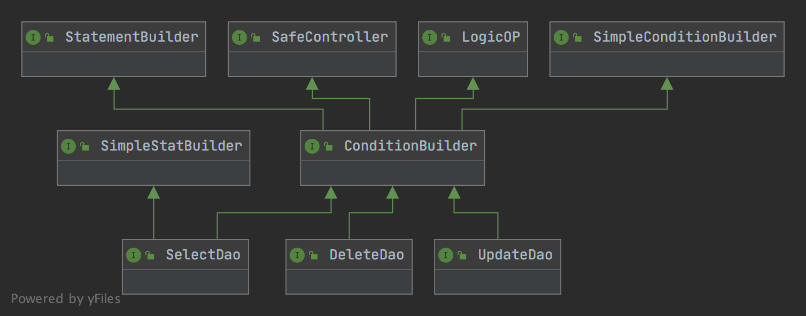

### 简介 
   
   SimpleDao是一个使用注解生成SQL语句和参数的组件，通过在DTO对象中加入自定义注解自动生成查询语句。

   在项目中应用本组件能实现不编写SQL语句。组件支持Where子句、标量统计函数和Group By子句、Having子句、Order By子句、Select子句、Update Set子句、子查询、逻辑删除，安全模式等。
 
   目前组件基于JPA/Hibernate，如果非JPA环境，可以使用  genFinalStatement()、 genFinalParamList() 方法以来获取SQL语句和参数。
  
   测试用例类 [com.levin.commons.dao.DaoExamplesTest](./simple-dao-examples/src/test/java/com/levin/commons/dao/DaoExamplesTest.java)  
   
### 二进制发布

   
   
   二进制文件发布在[jitpack.io](https://www.jitpack.io/#Levin-Li/simple-dao)
   
         
        <repositories> 
            <repository>
                <id>jitpack.io</id>
                <url>https://www.jitpack.io</url>
            </repository>  
        </repositories>
           
        <dependency>
            <groupId>com.github.Levin-Li.simple-dao</groupId>
            <artifactId>simple-dao-jpa-starter</artifactId>
            <version>2.5.3-SNAPSHOT</version>
        </dependency>
        
       
   
### 1  组件注解核心接口

Dao 类逻辑框图，如下图所示。

      
   
主要以下4个核心接口：

*    1 - [SimpleDao](./simple-dao-core/src/main/java/com/levin/commons/dao/SimpleDao.java)

*    2 - [SelectDao](./simple-dao-core/src/main/java/com/levin/commons/dao/SelectDao.java)

*    3 - [UpdateDao](./simple-dao-core/src/main/java/com/levin/commons/dao/UpdateDao.java)

*    4 - [DeleteDao](./simple-dao-core/src/main/java/com/levin/commons/dao/DeleteDao.java)
       
### 2  组件的使用

##### 2.1 使用SimpleDao

   在服务层代码中通过Spring注入SimpleDao实例。

   使用示例：

      @Autowired
      SimpleDao dao;

      List<UserStatDTO> queryResult = dao.findByQueryObjs(new UserStatDTO()).find();

##### 2.2 动态创建 SelectDao 、UpdateDao、DeleteDao

    @Autowired
    SimpleDao dao;

    //查询DAO
    //方式1：
    SelectDao selectDao = dao.selectFrom(Group.class);
    //方式2：
    SelectDao selectDao = dao.forSelect(Group.class, queryObjs)

    //更新DAO
    //方式1：
    UpdateDao updateDao = dao.updateTo(Group.class);
    //方式1：
    updateDao = dao.forUpdate(Group.class, queryObjs)

    //删除DAO
    //方式1
    DeleteDao deleteDao = dao.deleteFrom(Group.class)
 
    //方式2
    DeleteDao deleteDao = dao.forDelete(Group.class, queryObjs)

##### 2.3 回调使用 
    
       //1、回调接口定义：java.util.function.Consumer<SelectDao/UpdateDao/DeleteDao>
       //支持3种dao回调
       
       //2、回调实例
       Consumer<SelectDao<?>> callback = dao -> {
            //在回调中动态增加查询条件
            dao.orderBy(OrderBy.Type.Desc,E_AfterSaleOrder.create_time);
            dao.eq("name","lily");
        };
       
      //3、回调使用
      simpleDao.findPagingDataByQueryObj(req,callback,paging);

### 4 基础查询
    
   查询注解主要在 com.levin.commons.dao.annotation 包中，包括常见的 SQL 操作符，具体如下图：
   
        
   
   注意: 如果字段没有注解，相当于是 Eq 注解，字段值为null值或是空字符串，将不会产生 SQL 语句。

   查询DTO字段定义示例：

       @Desc("店铺id") 
       Long storeId;

       @Desc("店铺名称")
       @Contains
       String storeName;

       @Desc("店铺状态") 
       StoreStatus storeStatus;
       
       //自动迭代出现多个StartsWith
       @StartsWith("name")
       List<String> nameList = Arrays.asList("Test", "LLW");

   支持持久化前和查询结果后的转换，通过 InjectVar 注解实现。
   
   查询结果的转换
   
          //案例1： 在数据库中存的是字符串，查询出来后自动转换成对象。
          
          Entity --> DTO
          
          @Desc("参与者列表，Json List")
          @InjectVar(converter = DefaultJsonConverter.class)
          List<Integer> actions; 
          

  持久化的转换
       
          //案例2： 在保存前是对象，持久化前自动转换成json字符串，存入数据库。
          
          DTO --> Entity 
          
          //Dto上的字段定义
          List<Integer> actions;
          
          //实体上的注解定义
          @InjectVar(converter = DefaultJsonConverter.class)
          String actions;
          
          
#### 4.1 列选择和列更新

##### 4.1.1 列选择

          @Select
          String field;

  产生的语句：

         select field from ...
          
         
  使用例子：
  
        @Data
        @Accessors(chain = true)
        @TargetOption(entityClass = Group.class, alias = E_Group.ALIAS, maxResults = 100)
        public class GroupSelectDTO {
        
            //如果字段名中有小数点这个字符，需要强制指定别名
            @Select(domain = E_Group.ALIAS, value = "parent.name")
            String parentName;
        
            @Select(distinct = true, orderBy = @OrderBy)
            String name;
            
        }       

  复杂例子：
  
                        
        @Data
        @TargetOption(entityClass = User.class, alias = E_User.ALIAS, resultClass = SimpleSubQueryDTO.class)
        public class SimpleSubQueryDTO {
    
        //分页
        Paging paging = new PagingQueryReq(1, 20);
    
        @Select(condition = "taskCnt > 0 && #_val > 0 && taskSum > 9875"
                , value = "select count(*) from " + E_Task.CLASS_NAME + "   where " + E_Task.user + " = u.id")
        int taskCnt = 1;
        
        // 以上字段生成语句： (select count(*) from com.levin.commons.dao.domain.Task   where user = u.id) AS taskCnt
    
    
        @Ignore
        Integer taskSum = 9876;
    
        @Select(value = "select ${fun}(score) from " + E_Task.CLASS_NAME
                + "   where  " + E_Task.user + " = u.id and ${p2} != ${:p1}",
                alias = "taskSum")
        Map<String, Object> params = MapUtils
                .put("p1", (Object) "9999")
                .put("p2", 2)
                .put("fun", "sum")
                .build();
        //以上字段生成语句： (select sum(score) from com.levin.commons.dao.domain.Task   where  user = u.id and 2 !=  ? ) AS taskSum
     
        }
 
##### 4.1.1 列更新 + 增量更新

  更新注解：

         @Update
         protected Date lastUpdateTime = new Date();

  产生的语句

         set lastUpdateTime = ?

 增量更新-使用例子1：字段加一       
  
             
         @Update(paramExpr = "${_name} + 1")
         Integer alarmCnt;
         
         //以上生成的语句
         // set alarmCnt = alarmCnt + 1

 增量更新-使用例子2：字段加参数值       
   
         @Update(paramExpr = "${_name} + ${:_val}")
         Integer alarmCnt = 5 ;
         
         //以上生成的语句
         // set alarmCnt = alarmCnt + ?     
                     
 @Select 和 @Update 可以定义在类上，当字段上没有注解时表示，将默认使用类上定义的注解，如下：
 
       @Schema(title = "增量更新设备数据")
       @Data 
       @NoArgsConstructor 
       @ToString
       @Accessors(chain = true)
       @FieldNameConstants
       @TargetOption(entityClass = Device.class, alias = E_Device.ALIAS)
       //默认更新注解
       //防止出现负数逻辑
       @Update(paramExpr = "${_name} + (CASE WHEN ( ${_name} + ${_val} ) >= 0 THEN ${_val} ELSE 0 END)"
               , condition = " #_val != null && #_val != 0")
       public class IncrementEditDeviceReq extends BaseServiceReq {
       
           private static final long serialVersionUID = 362651129L;
       
           @Schema(title = "id")
           @NotNull
           @Eq(require = true)
           private Long id;
       
           @Schema(title = "实时运行告警数（0为未告警，n为告警条数")
           private Integer runAlarmCnt;
       
           @Schema(title = "状态告警数（0：无告警，n为告警条数)")
           private Integer statusAlarmCnt;
       
           @Schema(title = "合同告警数（含有租金、押金、合同告警条数）")
           private Integer contractAlarmCnt;
       
           public IncrementEditDeviceReq(Long id) {
               this.id = id;
           }
       
           @PostConstruct
           public void preUpdate() {
               //更新之前初始化数据
           }
       
       }
 

#### 4.2 CASE 语句支持

##### 4.2.1 注解支持
  
      @Data
      @Accessors(chain = true)
      @TargetOption(isNative = true, entityClass = User.class, alias = E_User.ALIAS, maxResults = 20)
      public class CaseTestDto {
      
          @C
          @CList({@C(op = Op.StartsWith)})
          @Select
          String name;
      
          // states = {"正常", "已取消", "审请中", "已删除", "已冻结"};
      
          @Select(value = E_User.score, fieldCases = {
          
                  // case 1 的条件 #_val == 1
                  
                  @Case(value = "", elseExpr = "5", condition = "#_val == 1", 
                  whenOptions = {
                            @Case.When(whenExpr = "F$:score > 95 AND F$:u.lastUpdateTime is null", thenExpr = "1")
                          , @Case.When(whenExpr = "score > 85", thenExpr = "2")
                          , @Case.When(whenExpr = "score > 60", thenExpr = "3")
                          , @Case.When(whenExpr = "score > 30", thenExpr = "4")
                  })
      
                    // case 2 的条件 #_val == 2 && queryState
                    
                  , @Case(value = E_User.state, elseExpr = "5", condition = "#_val == 2 && queryState", 
                      whenOptions = {
                        @Case.When(whenExpr = "'正常'", thenExpr = "1")
                      , @Case.When(whenExpr = "'已取消'", thenExpr = "2")
                      , @Case.When(whenExpr = "'审请中'", thenExpr = "3")
                      , @Case.When(whenExpr = "'已删除'", thenExpr = "4")
                      })
          })
          int scoreLevel = 1;
      
          @Ignore
          boolean queryState = false;
          
      }
     
     //以上注解将生成以下语句
     
      //Select  (u.name) AS name  ,  
           (CASE  
             WHEN u.score > 95 AND u.lastUpdateTime is null THEN 1 
             WHEN score > 85 THEN 2 WHEN score > 60 THEN 3 
             WHEN score > 30 THEN 4 
             ELSE 5 
             END) AS scoreLevel   
           From com.levin.commons.dao.domain.User u 
            
    
#### 4.3 函数的支持（@Func注解实现）     
           
           class XXX {
            @Lt(fieldFuncs = @Func(value = "DATE_FORMAT",params = {Func.ORIGIN_EXPR,"${format}"}))
            protected Date createTime = new Date();
            
            @Ignore
            String format ="'yyyy-MM-DD'";
            
            ...
            
            }
            //字符串类型的 createTime 字段
            //以上注解将生成语句： DATE_FORMAT(createTime,'yyyy-MM-DD') < ?  ,  参数为 new Date()
            
            // Func.ORIGIN_EXPR 代表原表达式
            
            //定义多个函数时，后面的函数会覆盖前面的函数 ，但可以通过 Func.ORIGIN_EXPR 实现嵌套，后面嵌套前面的函数。
             

#### 4.4 查询上下文 & 变量

   在一次查询的过程中，Dao会保持一个上下文，查询对象的所有字段值都会放入上下文中，也可以通过 @CtxVar 注解设置上下文。上下文中的变量主要在 condition 条件中使用。
   
##### 4.4.1  查询上下文

     上下文列表（越后面优先级越高）：
     
        1、DaoContext.getGlobalContext(); //全局上下文
        
        2、DaoContext.getThreadContext(); //线程上下文
        
        3、dao.selectFrom(User.class).setContext(); //dao 实例上下文
        
        4、查询对象字段上下文
        
##### 4.4.2 变量
        
   默认变量-1：

       _val 表示被注解字段的值
    
       _this 表示DTO对象
    
       _name 表示被注解字段的字段名
    
       _isSelect 表示当前是否是SelectDao
    
       _isUpdate 表示当前是否是UpdateDao
    
       _isDelete 表示当前是否是DeleteDao
       
       
       使用例子：
       @Eq(condition="#_val != null") // 变量 #_val 的值为 "Echo"
       String name = "Echo";     
  
   默认变量-2：查询对象的字段名做为变量名
   
   例：
   
       class QueryObj{
         
         @GroupBy(condition = "isGroupByName") // 变量 isGroupByName 是当前类的字段
         String name;
         
         @Sum
         Integer sumScore;
         
         boolean isGroupByName = true; 
         
       }

   默认变量-3：通过 [CtxVar](./simple-dao-annotations/src/main/java/com/levin/commons/dao/CtxVar.java)   注解增加变量。
   
   通常用于跨类的变量传递，通过 CtxVar 注解配置。 
   
      @Data
      @Accessors(chain = true)
      @TargetOption(entityClass = User.class, alias = E_User.ALIAS, resultClass = SimpleUserQO.QResult.class)
      public class SimpleUserQO {
      
          @Data
          @NoArgsConstructor
          public static class QResult {
      
              @Select
              String name;
      
              @Select
              Integer score;
      
              //有条件的查询状态信息,变量huo
              @Select(condition = "isQueryStatus")
              String status;
          }
       
     
          @Lt
          protected Date createTime = new Date();
      
          @Ignore
          String format = "YYYY-MM-DD";
      
          @Ignore
          @CtxVar //把 isQueryStatus 变量注入到当前上下文中
          boolean isQueryStatus = true;
      
      } 
      
##### 4.4.3 变量的使用方式
   
###### 4.4.3.1 文本替换   

   字段变量的替换
   
  同时同时兼容原生查询和JPA查询的字段，支持使用字段替换变量，格式：F$:[alias.]classFieldName
   
      F$:score > 95 AND F$:u.lastUpdateTime
      
      以上表达式当原生查询时语句被替换成：u.score > 95 AND u.last_update_time
      当使用 JPA 查询时语句被替换成：u.score > 95 AND u.lastUpdateTime
      
      没有指定别名的字段，自动加上别名。
      
  替换变量
  
      SQL查询参数匹配样式：${:paramName}  如下: 
       
          t.score +  ${:val}    替换后的语句 -->     t.score +  :?          
      
      文本替换样式：${paramName}   如下：
      
       t.score +  ${val}    替换后的语句 -->     t.score +  123 
       
       @Avg(value = "score",t.score +  ${val}")  --> 表达式会被替换为 t.score + 10
       Map<String,Object> params = [val:10]
       
      
        @Select(value = "select ${fun}(score) from " + E_Task.CLASS_NAME + "   where  " + E_Task.user + " = u.id and ${p2} != ${:p1}", alias = "taskSum")
        Map<String, Object> params = MapUtils.putFirst("p1", "9999").put("p2", 2).put("fun", "sum").build();
        
       / /以上字段生成语句： (select sum(score) from com.levin.commons.dao.domain.Task   where  user = u.id and 2 !=  ? ) AS taskSum
       
      
     主要区别是冒号，加了冒号表示替换成参数。
     
###### 4.4.3.2 Spel 表达式

   例如：在 condition 属性上示 SPEL表达式，默认变量名前面需要加 # 号，如下
  
        @Eq(condition="#_val != null") //_val 变量名前要加#号
        String name = "Echo";
        
        @Gt(condition="#_val != null") //_val 变量名前要加#号
        Integer age = 18;
           
   例如：组校验，基于 SPEL 实现跨字段的参数验证，通过 @Validator 注解实现。
   
     public class DeleteCustomerReq extends BaseTreeQueryReq implements ServiceReq {
     
         private static final long serialVersionUID = -350965260L;
     
         @Schema(title = "ID")
         private Long id;
     
         @Schema(title = "ID集合")
         @In(E_Customer.id)
         @Validator(expr = "id != null || ( ids != null &&  ids.length > 0)" , promptInfo = "删除客户信息表必须指定ID")
         private Long[] ids;
         
         //删除客户信息表必须指定ID或是 ID 列表
     
         public DeleteCustomerReq(Long id) {
             this.id = id;
         }
     
         public DeleteCustomerReq(Long... ids) {
             this.ids = ids;
         }
     
     }
   
         
### 5 统计查询

   统计注解在com.levin.commons.dao.annotation.stat 包中，主要包括以下注解：
   
        @Avg
        @Max
        @Min
        @Sum
        @Count
        @GroupBy
        
   
   统计注解 有一个 havingOp 属性，用来表示 Having 查询字句，如：
     
         @Avg(havingOp = Op.Gt)
         Long avgScore = 10L;
         
         @GroupBy
         @Gt 
         int month = 5;
   
   以上注解将产生语句： select month , AVG(score) from XXX where month > 5 having AVG(score) > 10 
   
   Dao 支持多表统计，编码实现，如下例子：
   
       
       dao.selectFrom(Group.class, "g")
                       .join("left join " + User.class.getName() + " u on g.id = u.group.id")
                       .join("left join " + Task.class.getName() + " t on u.id = t.user.id")
                       .count("1")
                       .avg("t.score")
                       .avg("u.score")
                       .avg("g.score")
                       .sum("t.score")
                       .groupByAsAnno(E_Group.name)
                       .find();
                       
 
   Dao 支持多表统计，通过注解实现
   
       @Data
       @Accessors(chain = true)
       @TargetOption(
               entityClass = User.class, alias = E_User.ALIAS,
               resultClass = TableJoinDTO.class,
               isSafeMode = false,
               //连接表
               joinOptions = {
                       @JoinOption(alias = E_Group.ALIAS, entityClass = Group.class)
               })
       public class TableJoinDTO {
       
           @Select(value = "u.id", isDistinct = true)
           @Gt(value = E_User.id, domain = E_User.ALIAS)
           Long uid;
       
           @Select(value = E_Group.id, domain = E_Group.ALIAS)
           @Gte("g.id")
           Long gid;
       
           @Select
           String name;
       
           @Select(domain = E_Group.ALIAS, value = E_Group.name)
           String groupName;
       
       }               
       
              
### 6 多表关联查询

#### 6.1 多表关联查询-用 JoinOption 注解关联实体对象 [TableJoinStatDTO](./simple-dao-examples/src/test/java/com/levin/commons/dao/dto/TableJoinStatDTO.java) 
   
   注解代码  @JoinOption(entityClass = Group.class, alias = E_Group.ALIAS)，会自动找实体对象之间的关联字段。
   对象 User 中有 Group类型的字段，但有多个Group类型的字段时，需要手动指定关联的字段
   
      //查询对象，和结果对象
      @Data
      @Accessors(chain = true)
      @TargetOption(
              entityClass = User.class, //主表
              alias = E_User.ALIAS, //主表别名
              resultClass = TableJoinStatDTO.class, //结果类
              safeMode = false, //是否安全模式，安全模式时无法执行无条件的查询
              //连接表
              joinOptions = {
                      @JoinOption(entityClass = Group.class, alias = E_Group.ALIAS)  //连接的表，和别名
              })
      public class TableJoinStatDTO {
      
          //统计部门人数，并且排序
          @Count(havingOp = Op.Gt, orderBy = @OrderBy)
          Integer userCnt = 5;
      
          //统计部门总得分
          @Sum
          Long sumScore;
      
          //统计部门平均分，并且排序
          @Avg(havingOp = Op.Gt, orderBy = @OrderBy,alias = "avg")
          Long avgScore = 20L;
      
          //按部门分组统计，结果排序
          @GroupBy(domain = E_Group.ALIAS, value = E_Group.name,orderBy = @OrderBy())
          String groupName;
      
      }
       
        //执行查询，并把查询结果放在TableJoinStatDTO对象中
       List<TableJoinStatDTO> objects = dao.findByQueryObj(new TableJoinStatDTO());
       
       //生成的语句
       Select Count( 1 ) , Sum( u.score ) , Avg( u.score ) AS avg , g.name  
       From com.levin.commons.dao.domain.User u  Left join com.levin.commons.dao.domain.Group g on u.group = g.id     
       Group By  g.name 
       Having  Count( 1 ) >   ?1  AND Avg( u.score ) >   ?2  
       Order By  Count( 1 ) Desc , Avg( u.score ) Desc , g.name Desc
       
       
#### 6.2 多表关联查询-用 JoinOption 注解  [TableJoin3](./simple-dao-examples/src/test/java/com/levin/commons/dao/dto/TableJoin3.java)   
       
   以下 @TargetOption 注解部分，手动指定关联的别名和关联的字段，joinTargetAlias = E_User.ALIAS , joinTargetColumn = E_User.group。
        
       @Data
       @Accessors(chain = true)
       @TargetOption(tableName = E_User.CLASS_NAME,alias = E_User.ALIAS,
               joinOptions = {
               @JoinOption(tableOrStatement = E_Group.CLASS_NAME,
                       alias = E_Group.ALIAS,joinColumn = E_Group.id,joinTargetAlias = E_User.ALIAS,joinTargetColumn = E_User.group)
       })
       public class TableJoin3 {
       
           @Select(domain = E_User.ALIAS, value = E_User.id, isDistinct = true)
           @Gt(value = E_User.id, domain = E_User.ALIAS)
           Long uid = 1l;
       
           @Select(value = E_Group.id, domain = E_Group.ALIAS)
           @Gte(domain = E_Group.ALIAS,value = E_Group.id)
           Long gid;
       
           @Select
           String name;
       
           @Select(domain = E_Group.ALIAS, value = E_Group.name)
           String groupName;
       
       }
          
          
          
#### 6.3 多表关联查询-直接用TargetOption 注解的 tableName（或是fromStatement） 属性拼出连接语句 [FromStatementDTO](./simple-dao-examples/src/test/java/com/levin/commons/dao/dto/FromStatementDTO.java) 
   
   注解代码 @TargetOption( tableName = "jpa_dao_test_User u left join jpa_dao_test_Group g on u.group.id = g.id" )
      
       
       @Data
       @Accessors(chain = true)
       @TargetOption(
               tableName = "jpa_dao_test_User u left join jpa_dao_test_Group g on u.group.id = g.id" ,
       //        fromStatement = "from jpa_dao_test_User u left join jpa_dao_test_Group g on u.group = g.id"
               )
       public class FromStatementDTO {
       
           @Select(value = "u.id", isDistinct = true)
           @Gt(value = E_User.id, domain = "u")
           Long uid = 1l;
       
           @Select(value = E_Group.id, domain = "g")
           @Gte("g.id")
           Long gid;
       
           @Select(domain = "u")
           String name;
       
           @Select(domain = "g", value = E_Group.name)
           String groupName;
       
       } 
       
       
#### 6.4 多表关联查询-笛卡儿积

       可以用@SimpleJoinOption注解方式，也可以直接代码方式，如下：
       
         List<Object> objects = dao.selectFrom(User.class, E_User.ALIAS)
                      .join(true, Group.class, E_Group.ALIAS)
                      .select(true, "u")
                      .where("u.group.id = g.id ")
                      .isNotNull(E_User.id)
                      .gt(E_User.score, 5)
                      .limit(0, 20)
                      .find();
                      
            
                                  
### 7 复杂查询(逻辑嵌套)

   逻辑注解支持

     @AND
        @OR
        @END
     @END

     #逻辑注解可以嵌套使用，当有一个节条件不成立时，嵌套的所有子条件都将被忽略

    //以下为代码片段

    @AND(condition = "#_val == true")
    protected Boolean editable = true;

    @Lt
    @OR(condition = "#_val!=null")
    protected Date createTime = new Date();

    @Between("score")
    @End
    protected Integer[] scores = new Integer[]{200, 100};

    @Like
    @End
    protected String description = "keywords";

  以上注解将生成如下语句：

      editable = ?
      and ( createTime < ? or  scores Between ? and ? )
      and description like ?

  Dao 方法支持
    
     //逻辑嵌套
     dao.selectFrom("table").and().or().and().end().end().end();

### 8 子查询

#### 8.1 手动指定子查询语句

          @Data
          @TargetOption(entityClass = User.class, alias = E_User.ALIAS, resultClass = SimpleSubQueryDTO.class)
          public class SimpleSubQueryDTO {
          
              Paging paging = new PagingQueryReq(1, 20); 
         
              @Lt(value = E_User.score, paramExpr = "(select sum(score) from " + E_Task.CLASS_NAME + "   where " + E_Task.user + " = u.id and ${taskCnt} = ${:_val})")
              @Gt(value = "(select count(*) from " + E_Task.CLASS_NAME + "   where " + E_Task.user + " = u.id and ${taskSum} > ${:taskCnt} )")
          
              @Select(condition = "taskCnt > 0 && #_val > 0 && taskSum > 9875" , value = "select count(*) from " + E_Task.CLASS_NAME + "   where " + E_Task.user + " = u.id")
              int taskCnt = 1;
          
              @Ignore
              Integer taskSum = 9876;
          
              // 以上字段生成语句： (select count(*) from com.levin.commons.dao.domain.Task   where user = u.id) AS taskCnt
          
              @Select(value = "select ${fun}(score) from " + E_Task.CLASS_NAME + "   where  " + E_Task.user + " = u.id and ${p2} != ${:p1}", alias = "taskSum")
              Map<String, Object> params = MapUtils.put("p1", (Object) "9999").put("p2", 2).put("fun", "sum").build();
              //以上字段生成语句： (select sum(score) from com.levin.commons.dao.domain.Task   where  user = u.id and 2 !=  ? ) AS taskSum
          
          
              //生成的语句
              //Select  (select count(*) from com.levin.commons.dao.domain.Task   where user = u.id) AS taskCnt  ,
              //        (select sum(score) from com.levin.commons.dao.domain.Task   where  user = u.id and 2 !=  ?1 ) AS taskSum
              //From com.levin.commons.dao.domain.User u
              //Where u.score <   (select sum(score) from com.levin.commons.dao.domain.Task   where user = u.id and 1 =  ?2 )
              //     AND (select count(*) from com.levin.commons.dao.domain.Task   where user = u.id and 9876 >  ?3  ) >   ?4
          
              //生成的参数列表
             // Params:[9999, {requireTotals=false, requireResultList=true, pageIndex=1, pageSize=20, fromCache=null}, 1, 1, 1, {taskCnt=1, taskSum=9876}]
          
          }

#### 8.2  使用嵌套查询对象

        //子查询，子查询将从subQueryDTO查询对象中生成
        @NotExists
        DTO subQueryDTO = new DTO();

        //In注解，将生产子查询
        @In("status")
        DTO subQueryDTO = new DTO();

            //子查询，并使用命名参数，命名参数从Map变量中取
            @NotExists(paramExpr = "select '${_name}' from jpa_dao_test_User t where u.id = t.id and t.score > ${:minScore} and t.name like ${groupName}")
        //            int minScore =5;
            Map<String, Object> namedParams = new HashMap<>();
        
        
            //子查询，子查询将从subQueryDTO查询对象中生成
            @NotExists
            SubQueryDTO subQueryDTO = new SubQueryDTO();

### 9 排序(OrderBy注解)

   排序使用OrderBy注解，OrderBy支持字段和参数。

    @Contains
    @OrderBy
    String name = "test";

    @OrderByList(
            {
                    @OrderBy(E_User.createTime),
                    @OrderBy(value = E_User.area, order = 5,type = OrderBy.Type.Asc),
                    @OrderBy(condition = C.NOT_NULL)
            }
    )
    String orderCode ="1111";

   以上将生成OrderBy将生成如下语句：

    Order By  area Asc , name Desc , createTime Desc , orderCode Desc
    
    
   简单排序注解 SimpleOrderBy 
   一般情况下不建议使用，有SQL注入风险。
   
         @SimpleOrderBy(condition = "state.length > 0")
         String[] orderBy = {"state desc", "name asc"};
     
         @SimpleOrderBy(condition = "name != null")
         String orderBy2 = "score desc , category asc";  

### 10 字段注解

#### 10.1  查询对象字段无注解

##### 10.1.1 基本类型字段无注解

  基本类型无注解示例：

       Long id;
       String name = "Echo";

  需要看类上的默认注解，如果类定义上面无默认注解 ，将默认为等于操作注解。以上注解将产生如下语句：

      name = ?

  注意以上id字段并没有生产条件，默认情况下，字段值为null值或是空字符串，字段都将被忽略。

##### 10.1.2 复杂类型字段无注解

   复杂类型的定义为：

   a)非基本类型

   b)非基本类型的数组

   复杂类型无注解法例：

      //无注解
      DTO queryDTO = new DTO();

   以上字段将会被递归解析，所产生的语句将会被加入当前语句中。
   

#### 10.2 强制忽略

   可以通过 Ignore 注解强制忽略指定的字段或是类。
   如果注解标注在 Modifier.STATIC | Modifier.FINAL | Modifier.TRANSIENT 三种字段上也将被忽略。

     //忽略字段
     @Ignore
     String tempValue = "Echo";

     //忽略的类，整个类将被忽略
     @Ignore
     public class xxDTO{
     ...
     }

#### 10.3 有条件忽略(SPEL表达式)

   大部分的注解都有 condition 属性，以脚本的方式求值，目前只支持SpEL，当返回true时，表示注解生效，如下：

      @Eq(condition="#_val != null")
      String name = "Echo";
      
  当 condition 设置为空字符串时，表示没有条件，默认为注解生效，如下：
  
      @Eq(condition="")
      String name = "Echo";

    
 
#### 10.4 字段值自动转换

##### 10.4.1 查询结果对象值转换  
 
   组件集成Spring的值转换功能，如果可以把字符串转换成数组，把字符串转换成日期、数值等。
   日期类型转换使用 Spring 的注解 DateTimeFormat 
   数值类型转换使用 Spring 的注解 NumberFormat

   如下例子：
    
    //实体对象
     class Entity{
      Long id; 
      Date createTime;
      }
    
     //查询结果对象
     class ResultDto {
     
       //自动转换为字符串
       String id; 
      
      @GroupBy
      @DateTimeFormat(pattern = "yyyy-MM-dd")  
      String createTime;
      
      }
      
##### 10.4.2 查询对象值转换   
   
   把 DTO 对象的值转换成数据库查询需要的值类型
    
   日期字段转换
   
      @Between(paramDelimiter = "-", patterns = "yyyyMMdd")  // 参数将用 - 号分隔
      String betweenCreateTime = "20190101-20220201"; //生成语句 createTime between ? AND ?
          
       
   In ,NotIn ,Between 等注解自动切割字符串为多个参数，如果数据库字段定义是字符串，则不自动用逗号分割，也可以强制指定分隔符 paramDelimiter。
   
      @NotIn(paramDelimiter = ",")
      String notInName = "A,B,C";  //生成语句 name not in (:?,:?,:?)
      
      
      @In(not = true, having = true)
      String[] state = new String[]{"A", "B", "C"};   //生成语句 Not(state in (:?,:?,:?)) 
        
    
### 11  避免 N + 1 查询        

#### 前置提示

   禁用spring boot 视图事务，设置 open-in-view: false，如下：

      jpa:
        show-sql: false
        generate-ddl: true
        database: H2
        #关闭视图事务，避免jpa 出现 N + 1 查询
        open-in-view: false
        hibernate:
          ddl-auto: update
          naming:
            #模块表名前缀映射类，重要
            physical-strategy: com.levin.commons.dao.support.EntityNamingStrategy
   
          

#### 11.1 通过实体配置立刻抓取

   一对多，多对一模型定义 fetch = FetchType.EAGER
  
        @Entity    
        class User{
                ...
               @ManyToOne(fetch = FetchType.EAGER) 
               @JoinColumn(name = "group_id")
               Group group;
        }     
        
        @Entity   
         class Group {
                  ...
                
                 @ManyToOne(fetch = FetchType.EAGER) 
                 protected T parent; 
                 
                 @OneToMany(mappedBy = "parent", cascade = CascadeType.REMOVE) 
                 protected Set<T> children;
         }   
     
#### 11.2 通过代码抓取    
        
         //查询 User 实，直接通过连接获取所有的孩子节点，避免 N+1 查询   
         jpa.selectFrom(User.class,"u")
            .joinFetch("group.children") //设置立刻抓取 避免 N+1 查询 
            .find()   
        
  
#### 11.3 通过注解抓取
  
   查询对象和结果对象都可以增加抓取注解，通过 [Fetch](./simple-dao-annotations/src/main/java/com/levin/commons/dao/annotation/misc/Fetch.java) 注解实现。
   注意：如果在结果对象上使用这个注解，需要设置注解的 isBindToField 为 false，才会生效。
  
  
        @Data
        @Accessors(chain = true)
        public class UserInfo {
      
            @Fetch //设置立刻抓取 避免 N+1 查询 ，没有设置 isBindToField = true 该注解无效 
            Group group;
        
            @Fetch(value = "group.name" ,isBindToField = true ) //设置立刻抓取 避免 N+1 查询 
            String groupName;
        
            @Fetch(value = "group.children" ,isBindToField = true ) //设置立刻抓取 避免 N+1 查询 
            Collection<Group> parentChildren;
        
        }      
        
        //避免 N+1 查询
        List<UserInfo> userInfoList dao.selectFrom(User.class, "u").find(UserInfo.class)     
        
        

### 12 安全模式

   数据安全是非常重要的事情，DAO 增加安全模式能避免一些因为疏忽导致的数据安全问题。

   在安全模式下，必须指定部分条件，不允许无条件的更新、删除、查询。
    
   默认情况下 Dao 都是安全模式，可以调用 disableSafeMode() 禁用安全模式，如下：
    
    dao.deleteFrom(User.class)
                   .disableSafeMode()
                   .delete();
   
  
  同时也可以通过 EntityOption 注解的disableActions属性指定 Dao 禁止的操作。
  
     @EntityOption(disableActions = {EntityOption.Action.Delete}, logicalDeleteField = "state", logicalDeleteValue = "deleted")
     //注解声明实体不允许物理删除，dao 会自动执行逻辑删除。
   
       
#### 12.1 逻辑删除 & 权限控制

  dao 支持逻辑删除，逻辑删除后的数据，查询，更新，删除语句都会加上逻辑删除的条件。
  
  通过注解 [EntityOption](./simple-dao-annotations/src/main/java/com/levin/commons/dao/EntityOption.java)  实现，注解在实体类上。  
  
  逻辑删除必须要定义逻辑删除的字段和字段值。
  
  默认情况下 DeleteDao 会先尝试物理删除，删除失败后会尝试逻辑删除。
  
     @Entity(name = "simple_dao_test_entity")
     @Data
     @Accessors(chain = true)
     @FieldNameConstants
     @EntityOption(disableActions = {EntityOption.Action.LogicalDelete}, logicalDeleteField = "state", logicalDeleteValue = "deleted")
     public class TestEntity
             extends AbstractTreeObject<Long, TestEntity>
             implements StatefulObject<String> {
     
         @Id
         @GeneratedValue
         private Long id;
     
         @Desc("状态")
         @Column(nullable = false)
         String state = "C";
     
         @Desc("类别")
         String category;
     
         @Desc("分数")
         Integer score;
     
     }
  
  
   逻辑删除后，dao 可以通过 filterLogicDeletedData 来设定是否要过滤逻辑删除的数据，默认是过滤逻辑删除的记录。
   
    dao.selectFrom(TestEntity.class)
                  .filterLogicDeletedData(false)
                  .find(); 

#### 12.3 SimpleDao 动态指定目标表

     1、通过实现 QueryOption 接口动态指定

        simpleDao.findByQueryObj(new SimpleQueryOption().setEntityClass(User.class), new QueryUserReq());

     2、通过提供 EntityClassSupplier 指定
        
        EntityClassSupplier entityClassSupplier = () -> User.class;
        simpleDao.findByQueryObj( entityClassSupplier , new QueryUserReq());

     3、直接指定目标表的类名

        simpleDao.findByQueryObj(new QueryUserReq(),User.class);

                               
#### 12.3 DTO 数据初始化
 
   有标记 javax.annotation.PostConstruct 注解的Dto对象方法，将会在查询之前被执行。
   可以做些初始化的事情，比如初始化时间。

   注解 @PrePersist 的方法会在保存之前被执行。

   注解 @PreUpdate 的方法会再更新之前被执行。
   
     class UserDto{
     
       String name;
       
       Date createTime;
       
       Date updateTime;
       
       @PostConstruct
       public void init(){
          createTime = new Date();
       }
       
       //更新之前执行
        @PreUpdate
        public void preUpdate(){
            updateTime = new Date();
        }
         
       //持久化之前执行
       @PrePersist
       public void prePersist(){
          createTime = new Date();
       }              
     
     }
   
     
     
   
#### 12.3 注解的语句生成规则

  操作枚举类：[com.levin.commons.dao.annotation.Op](./simple-dao-annotations/src/main/java/com/levin/commons/dao/annotation/Op.java)，定义了常见的 sql 表达式。
  

  语句表达式生成规则： surroundPrefix + op.gen( funcs(fieldName), funcs([ paramExpr(优先) or 参数占位符 ])) +  surroundSuffix

               
       
### 13 代码生成

   代码生成模块支持服务类和控制器类的生成，参考快速上手部分内容。
   具体清参考 [simple-dao-code-gen-example](./simple-dao-code-gen-example/) 模块。
   代码会在编译阶段生成，生成后，再次编译运行即可。
   
   代码生成插件配置如下：

    <?xml version="1.0" encoding="UTF-8"?>
    <project xmlns="http://maven.apache.org/POM/4.0.0"
             xmlns:xsi="http://www.w3.org/2001/XMLSchema-instance"
             xsi:schemaLocation="http://maven.apache.org/POM/4.0.0 http://maven.apache.org/xsd/maven-4.0.0.xsd">
     
    <modelVersion>4.0.0</modelVersion>
    
    <groupId>com.levin.codegen.example</groupId>
    <artifactId>codegen-example</artifactId>
    <version>1.0.0-SNAPSHOT</version>
   
    <packaging>pom</packaging>
     
    <properties>

        <levin.simple-dao.groupId>com.github.Levin-Li.simple-dao</levin.simple-dao.groupId>

        <!-- 本地版本包名，请先在本机maven安装simple-dao -->
        <levin.simple-dao.groupId>com.levin.commons</levin.simple-dao.groupId> 
        <levin.simple-dao.version>2.5.3-SNAPSHOT</levin.simple-dao.version> 

        <levin.service-support.groupId>com.github.Levin-Li</levin.service-support.groupId>
        <levin.service-support.version>1.2.28-SNAPSHOT</levin.service-support.version>

    </properties>
  
    <repositories> 
        <repository>
            <id>jitpack.io</id>
            <url>https://www.jitpack.io</url>
        </repository> 
    </repositories>

    <pluginRepositories>
        <pluginRepository>
            <!--  插件库 -->
            <id>jitpack.io</id>
            <url>https://www.jitpack.io</url>
        </pluginRepository>
    </pluginRepositories>

    <build>
        <plugins>

            <plugin>
                <groupId>${levin.simple-dao.groupId}</groupId>
                <artifactId>simple-dao-codegen</artifactId>
                <version>${levin.simple-dao.version}</version>
                <configuration>
                    <!-- 生成的控制器代码是否包括目录-->
                    <isCreateControllerSubDir>true</isCreateControllerSubDir>

                    <!-- 是否生成BizController -->
                    <isCreateBizController>true</isCreateBizController>

                    <!-- 生成的DTO的Schema注解中描述的配置是否使用类引用-->
                    <isSchemaDescUseConstRef>true</isSchemaDescUseConstRef>
                </configuration>
                <dependencies>
                    <dependency>
                        <groupId>${levin.service-support.groupId}</groupId>
                        <artifactId>service-support</artifactId>
                        <version>${levin.service-support.version}</version>
                    </dependency>
                </dependencies>
            </plugin>
 
        </plugins>
    </build>
    
    </project>

   
### 14 附录

#### 14.1 测试用例

 请参考测试用例： [com.levin.commons.dao.DaoExamplesTest](./simple-dao-examples/src/test/java/com/levin/commons/dao/DaoExamplesTest.java) 
  
#### 14.2 联系作者

 邮箱：99668980@qq.com

